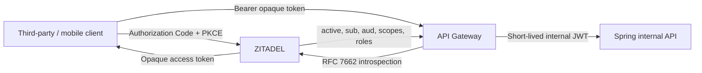
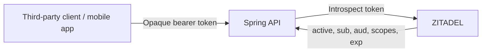

# ADL-008: ZITADEL with Opaque Token Introspection

- **Status:** Accepted
- **Date:** 2026-07-25
- **Supersedes:** [ADL-006](./006-keycloak-as-initial-self-hosted-idp.md)
- **Related:** [ADL-005](./005-separate-databases-for-idp-and-api.md)

Ultimate Goal:

Initially:

## Context

The Backend API is intended for public use, so need to allow different external clients. We want OAuth 2.0/OIDC, self-hosting, opaque access tokens with centralized introspection and revocation, and automated local/integration-test provisioning. These are initial requirements rather than a later migration from JWTs.

## Decision

Use **ZITADEL** as the IdP and issue opaque bearer access tokens. Initially, each Spring resource server will authenticate requests by calling ZITADEL's token-introspection endpoint. Introspection results may be cached briefly, never beyond token expiration.

Do not introduce an API gateway at the beginning. Only add it when it worth to do so, like multiple APIs, have extra time for refactoring, etc. Right now speed is first.

### Bootstrapping ZITADEL in our Docker Compose setup

After ZITADEL setup completes, run a one-shot OpenTofu init container to idempotently provision the organization, applications, roles, and test users.

## Alternative Considered

### Keycloak

Keycloak is mature, self-hostable, and easy to automate through realm imports. However, it issues JWT access tokens rather than true opaque/reference access tokens. Its introspection endpoint can inspect those JWTs, but introspection does not make the tokens opaque. Choosing Keycloak would therefore conflict with the decision to make opaque tokens and centralized validation part of the initial architecture.

### Authelia

Authelia supports opaque tokens and offers simple YAML configuration, but it is a narrower IAM product and has weaker API-driven provisioning for repeatable integration-test setup.

### Logto

Logto issues JWTs for registered API resources. Its opaque organization tokens are tied to organization-specific authorization and do not satisfy the general public API resource-token requirement.

### Ory

Ory supports the required architecture, but adopting it would require assembling and operating more components than ZITADEL.

### More

See more in [Opaque Token Support in LobeHub-Listed Self-Hostable Open-Source IdPs](ref/idp-compare.md)

## Consequences

Token validation adds a runtime dependency and network call to ZITADEL, so the backend thoughput is now bottlenecking by the idP. However, the architecture can later adopt a gateway with caching or etc. to boost performance, without changing the external token model. In return, token state and revocation remain centralized, token claims are not exposed to clients
