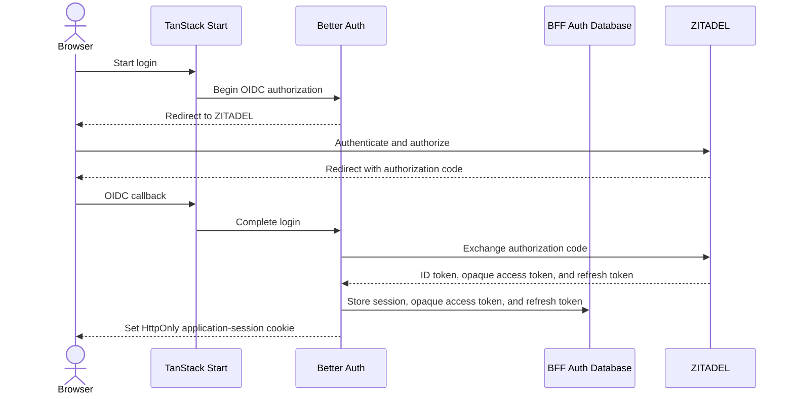
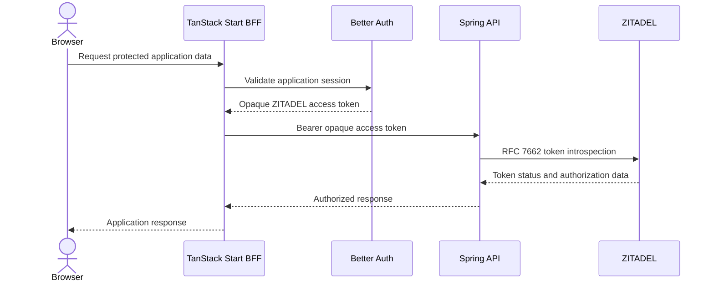

# ADL-009: TanStack Start BFF with Better Auth

- **Status:** Accepted
- **Date:** 2026-07-25
- **Related:** [ADL-005](./005-separate-databases-for-idp-and-api.md), [ADL-008](./008-zitadel-with-opaque-token-introspection.md), [GitHub issue #57](https://github.com/CXwudi/nijigen-video-site/issues/57)

## Context

ADL-008 selects ZITADEL as the identity provider and OAuth/OIDC authorization server. ZITADEL issues opaque access tokens, and the Spring API validates protected requests through token introspection. This supports mobile and third-party clients that call the public API directly.

The first-party web application needs a different browser-facing security boundary. Giving ZITADEL access or refresh tokens to browser JavaScript would increase the impact of a browser compromise and require the browser to manage OAuth tokens directly. The web application also needs persistent login sessions without making Spring responsible for browser session management.

Better Auth can run inside TanStack Start as the OIDC client and application-session layer. It complements ZITADEL rather than replacing it.

## Decision

Use TanStack Start as a backend for frontend (BFF) for the first-party web application. The browser calls TanStack Start for application data instead of calling Spring directly.

Run Better Auth inside the TanStack Start server runtime. Better Auth will:

- initiate and complete the ZITADEL OIDC authorization-code flow with PKCE.
- maintain the web application's server-side session.
- persist session data, ZITADEL opaque access tokens, and ZITADEL refresh tokens in a server-side database.
- give the browser only an HttpOnly application-session cookie.

ZITADEL opaque access tokens and refresh tokens must not be exposed to browser JavaScript. The Better Auth application-session cookie is a separate browser credential and is not a ZITADEL opaque access token.

For an authenticated API operation, TanStack Start obtains the user's opaque ZITADEL access token from the server-side auth layer and forwards it to Spring as a bearer token. Spring introspects the token with ZITADEL and remains responsible for scopes, roles, ownership, and other business authorization.

For public data, TanStack Start calls an explicitly public Spring endpoint without a bearer token. Public and authenticated request paths must remain distinct to avoid credential leakage and accidental caching of personalized responses.

Mobile and third-party clients remain able to use ZITADEL directly and call the public Spring API with their own opaque access tokens.

## Architecture

### Login and session flow

### Authenticated API flow

## Security Boundaries

- Better Auth establishes the web session; ZITADEL remains the canonical identity provider.
- ZITADEL's subject remains the stable identity shared with Spring and the API-owned profile described by ADL-005.
- The BFF auth database is server-only and is separate from ZITADEL-owned identity data and Spring-owned application profile data.
- TanStack route guards improve navigation and user experience but are not an authorization boundary.
- Every BFF operation that reads private data or performs a user action must validate the application session.
- Spring must independently authenticate and authorize every protected API request.

## Alternatives Considered

### Store ZITADEL tokens in the browser

This would let the browser call Spring directly, but it would expose ZITADEL opaque access tokens and refresh tokens to the browser runtime and make the frontend responsible for token storage and refresh. It does not provide the desired BFF security boundary.

### Use Better Auth as the identity provider

This would duplicate or replace ZITADEL's responsibility and conflict with ADL-008. Better Auth is used only as the first-party web application's OIDC client and session layer.

### Implement OIDC and web sessions directly in TanStack Start

This could produce the same architecture without Better Auth, but it would require custom implementation and maintenance of session persistence, provider-account storage, and authentication flows without a current project-specific benefit.

## Consequences

ZITADEL opaque access tokens and refresh tokens remain on the server side for the first-party web application, and the browser uses a conventional application session. Spring receives the same opaque access-token format from the BFF and other clients, so its authentication and authorization model stays consistent.

The BFF adds a server-side database and an additional request hop. TanStack Start becomes part of the authenticated request path and must apply appropriate cookie, cross-site request forgery, origin, caching, secret-management, and provider-token storage controls.
