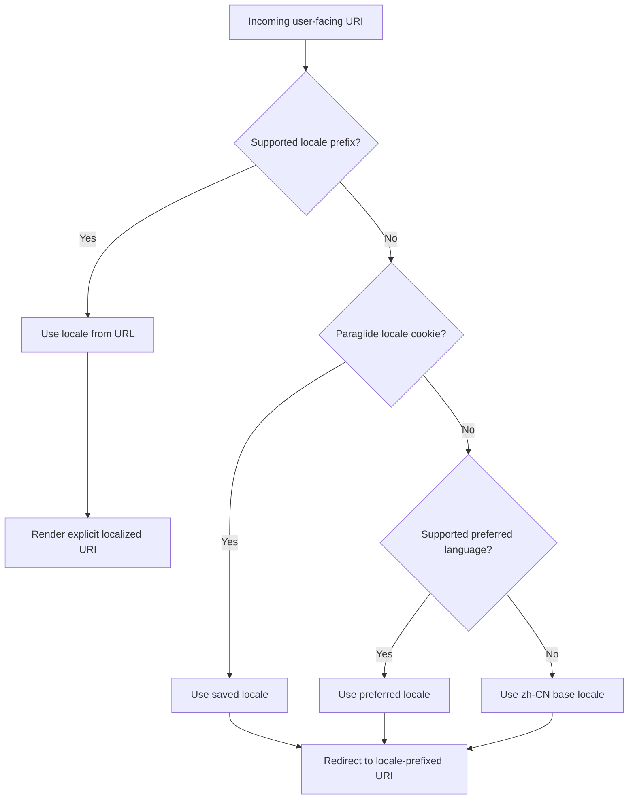

# ADL-010: Locale-Prefixed URLs with Preference-Based Entry Redirects

- **Status:** Accepted
- **Date:** 2026-08-03
- **Related:** [ADL-009](./009-tanstack-start-bff-with-better-auth.md)

## Context

The web application uses Paraglide JS with TanStack Start. The supported locales are `zh-CN` and `en`, and `zh-CN` remains the `baseLocale`.

Paraglide's default URL pattern leaves the base locale unprefixed. Under that pattern, `/` and every other unprefixed path resolve immediately to `zh-CN`, while English uses `/en/...`. Because the configured strategy evaluates `url` before `cookie` and `preferredLanguage`, a first-time visitor to any unprefixed URI receives Chinese even when the browser prefers English. The client then persists the resolved Chinese locale in the Paraglide locale cookie.

A visitor can enter the site through any user-facing URI, not only `/`. The routing policy therefore needs to work consistently for deep links such as `/videos/123`.

The design needs to satisfy these goals:

- Keep Chinese as the final fallback locale.
- Respect an explicit locale in a shared URL.
- Respect a saved locale when an incoming URL does not specify a locale.
- Use the browser's preferred language for a first visit when no locale cookie exists.
- Keep SSR output, hydration, shared links, SEO, and potential CDN cache keys deterministic by locale.
- Avoid duplicating Paraglide compiler options between Vite and test-time code generation.

## Reasoning

### Initial preference-first strategy

The initial strategy was `cookie -> preferredLanguage -> url -> baseLocale`. It supported saved preferences and browser-language negotiation for unprefixed first visits.

Used globally, however, this order allowed a cookie or browser preference to override an explicit localized URL. A user opening an English link could receive Chinese content, which weakened URL shareability, SSR determinism, and locale-based caching.

### URL-first strategy

The strategy was changed to `url -> cookie -> preferredLanguage -> baseLocale` so that a public URL authoritatively identified its locale.

With Paraglide's default URL patterns, the URL strategy also treats every unprefixed URI as the base locale. It therefore always resolves unprefixed entry requests to Chinese and prevents the cookie and preferred-language strategies from running.

### Root-only negotiation

Applying preference-based negotiation only to `/` would solve the homepage case but not deep-link entry. A first-time visitor can arrive at any URI, so root-only handling was rejected.

### CDN and personalized SSR discussion

A shared CDN can safely cache locale-specific HTML only when the locale is represented in the cache key, normally through the URL. Varying the same unprefixed URL by locale cookie or `Accept-Language` risks incorrect cache reuse and cache fragmentation.

Encoding locale in the URL does not make all SSR HTML publicly cacheable. A public video page may still render an authenticated user's name, avatar, permissions, or dehydrated TanStack Query data. Such a response is personalized and must not be placed in a shared full-page cache merely because its locale is deterministic.

This distinction led to separating the language-routing decision from the future authenticated-HTML caching policy.

## Decision

Prefix every supported locale in every localized user-facing page URL:

- Chinese: `/zh-CN/...`
- English: `/en/...`

This follows the [official TanStack Start Paraglide example](https://github.com/TanStack/router/blob/main/examples/react/start-i18n-paraglide/vite.config.ts), which prefixes both its base and non-base locales while keeping the URL strategy first.

Treat an unprefixed URI as a locale-neutral negotiation entry point rather than a canonical localized page.

Keep the global Paraglide strategy in this order:

```text
url -> cookie -> preferredLanguage -> baseLocale
```

Configure `urlPatterns` so that only prefixed paths identify a locale. The resulting request flow is:



Examples:

| Incoming request | Relevant preference | Result |
| --- | --- | --- |
| `/videos/123` | Cookie is `en` | `307 /en/videos/123` |
| `/videos/123` | No cookie; browser prefers English | `307 /en/videos/123` |
| `/videos/123` | No supported cookie or browser language | `307 /zh-CN/videos/123` |
| `/en/videos/123` | Cookie or browser prefers Chinese | Render English URL |
| `/zh-CN/videos/123` | Cookie or browser prefers English | Render Chinese URL |

Paraglide writes the resolved locale to `PARAGLIDE_LOCALE` when its client runtime initializes. No separate first-visit cookie is required: an absent locale cookie naturally falls through to `preferredLanguage`.

TanStack Router continues to use `deLocalizeUrl` for route matching and `localizeUrl` for emitted URLs. Paraglide middleware performs request-scoped locale resolution and document redirects. Locale changes use Paraglide's URL localization functions so the current path, query string, and hash are preserved.

Store the Paraglide compiler options in one typed module shared by the Vite plugin and programmatic compilation. The Paraglide CLI currently exposes the strategy option but not custom `urlPatterns`, so the test-time compiler entry point calls the compiler API with the same shared options instead of duplicating partial CLI arguments.

## Cache Boundary

This decision makes the language dimension deterministic for prefixed URLs. It does not authorize shared caching of authenticated or otherwise personalized SSR HTML.

Future HTTP cache policy should follow these boundaries:

- Locale-neutral entry redirects should not be treated as canonical cacheable HTML.
- Anonymous public HTML may be considered for shared caching when its response is identical for all users of that locale.
- Requests with an authenticated application-session cookie must bypass shared full-page caching when SSR output includes user-specific content.
- Authenticated workspace HTML and responses containing private dehydrated query data must use an appropriate private or no-store policy.
- Fingerprinted JavaScript, CSS, fonts, images, thumbnails, and video assets can be cached independently from SSR HTML.
- Varying a shared HTML cache by the full cookie header is not the preferred design because it creates high-cardinality cache keys and increases the risk of configuration mistakes.

The exact CDN provider, cache rules, cache-control headers, and anonymous-versus-authenticated routing policy remain separate implementation decisions.

## Alternatives Considered

### Keep the base locale unprefixed

This produces shorter Chinese URLs and follows Paraglide's default pattern. It was rejected because an unprefixed URI cannot simultaneously mean "explicit Chinese content" and "language-neutral first-visit entry." Preference-based negotiation would also make the same unprefixed URL produce different outcomes for different visitors.

### Use preference-first strategy globally

The order `cookie -> preferredLanguage -> url -> baseLocale` directly supports first-visit negotiation, but it allows stored or browser preferences to override explicit locale-prefixed links. Route-specific overrides could mitigate this, but they add policy complexity and still leave the unprefixed base-locale ambiguity.

### Add route overrides for every prefixed locale

A global preference-first strategy combined with URL-first overrides for `/en/...`, `/zh-CN/...`, and every future locale can preserve explicit links. This was rejected in favor of URL patterns that naturally make unprefixed URLs fall through while keeping all prefixed URLs URL-authoritative.

### Detect language only on the client

Client-only detection would delay redirects until hydration, cause a visible language or URL change, duplicate server behavior, and weaken SSR and crawler consistency.

### Cache unprefixed HTML by cookie and preferred-language headers

A CDN cache key could include locale cookies and `Accept-Language`, but this increases cache cardinality and operational complexity. It also does not solve authenticated HTML personalization. Locale-prefixed URLs provide a simpler and more observable cache boundary.

## Consequences

- Chinese remains the base and fallback locale but no longer receives shorter unprefixed canonical URLs.
- Existing and future localized page links include a locale prefix, including the base locale.
- Unprefixed deep links require a redirect before rendering localized content.
- Explicit shared links remain stable regardless of the recipient's saved or browser preference.
- Search-engine canonical URLs, sitemaps, and `hreflang` metadata must use prefixed URLs.
- Adding a locale requires adding it to the localized URL pattern mappings.
- The language portion of an HTML cache key can be derived from the URL.
- Personalized SSR HTML still requires an authenticated cache-bypass or private/no-store policy.
- Vite builds and test-time Paraglide generation use the same compiler configuration.
