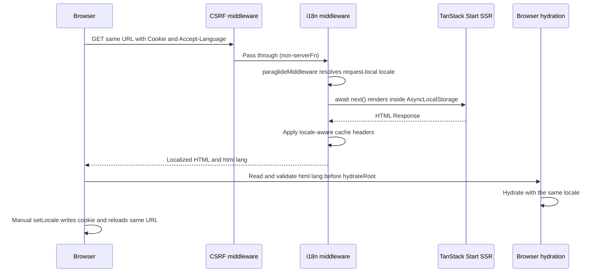

# Issue 31 TanStack Start i18n Implementation Plan

## Goal

Add English and Simplified Chinese localization for frontend-owned UI strings while preserving same-URL TanStack Start SSR. Each document must render and hydrate in one request-resolved locale without language flicker, and only a manual language change may persist a locale cookie.

## Context

GitHub issue #31 and its locked design comment define the product behavior. The approved design spec is [`../spec/spec-issue-31-tanstack-start-i18n-20260726.md`](../spec/spec-issue-31-tanstack-start-i18n-20260726.md), which is the source of truth for this plan.

The user chose to use Paraglide's built-in server strategy order `cookie, preferredLanguage, baseLocale` rather than a custom request-locale strategy. This keeps the implementation aligned with upstream Paraglide conventions and allows future upgrades to improve `Accept-Language` negotiation. The exact `Accept-Language` parsing behaviour (including `q=0` exclusion, generic `zh` alias mapping, and malformed-range handling) is delegated to the pinned `@inlang/paraglide-js@2.22.0` implementation.

At planning time, `frontend/web/` has one TanStack Start route, a hard-coded `<html lang="en">`, static English metadata and UI strings, Node-environment Vitest tests, and no i18n dependency or custom server/client entry. TanStack Router creates a fresh router and Query client for each server render; the i18n setup must preserve that lifecycle while Paraglide keeps locale state request-scoped.

The locale contract is:

1. A valid manually created `PARAGLIDE_LOCALE` cookie.
2. The best supported locale from `Accept-Language`.
3. The `zh-CN` base locale.

Only frontend-owned UI, metadata, validation/status text, and accessibility labels are in scope. Translated URLs, multilingual video fields or domain content, independent multilingual SEO, backend i18n, automatic persistence of detected locales, and preservation of unsaved in-memory state during switching remain out of scope.

Implementation succeeds when production SSR returns the correct locale and translations for the resolution matrix, hydration reuses the server locale without warnings or visible replacement, manual switching reloads the unchanged URL and creates the preference cookie, HTML responses are cache-safe, concurrent requests remain isolated, generated code stays uncommitted, and all frontend checks pass.

## Approach

Use pinned Paraglide JS compiler output as the typed message/runtime boundary, with committed inlang settings and JSON catalogs as the translation source. The compiled built-in strategy order (`cookie` → `preferredLanguage` → `baseLocale`) resolves each request's locale inside `paraglideMiddleware`. Wrap the standard TanStack Start server handler in that middleware, serialize the result through `<html lang>`, and install the browser locale override before React hydration. Add the language switcher only after the compiler, server, and hydration boundaries are independently verified.

## Runtime Flow



## File and Boundary Map

- `frontend/web/project.inlang/settings.json` and `frontend/web/messages/*.json`: committed configuration and translation source of truth.
- `frontend/web/src/paraglide/`: ignored compiler output; never edit or commit it.
- `frontend/web/vite.config.ts` and `frontend/web/package.json`: Paraglide Vite integration and clean-checkout generation commands.
- `frontend/web/src/start.ts`: defines `startInstance` via `createStart` with custom `requestMiddleware` containing the restored CSRF middleware and the i18n middleware that wraps `await next()` in `paraglideMiddleware` and applies locale-aware HTML response headers.
- `frontend/web/src/i18n/html-response.ts`: small testable helper for HTML cache headers and `Vary` merging.
- `frontend/web/src/client.tsx` and `frontend/web/src/i18n/client-locale.ts`: pre-hydration locale handoff.
- `frontend/web/src/routes/__root.tsx`: localized document language, direction, and metadata.
- `frontend/web/src/routes/index.tsx` and `frontend/web/src/components/LanguageSwitcher.tsx`: translated initial UI and manual language selection.
- `frontend/web/src/i18n/*.test.ts`: locale resolution, request isolation, cache headers, hydration-locale validation, and catalog behavior.
- `frontend/docs/`: human-authored usage and maintenance guidance requested after the implementation behavior is verified.

## Steps

When executing the plan:

- Mark `[ ]` boxes as completed `[x]` while this plan has not been merged. After it is merged, treat it as immutable and record later evidence or changes in issue #31 or a new design-log document.
- After the implementation and verification of each step, spawn a subagent to review the code and fix valuable feedback.
- Before moving to the next step, commit the changes.

### [x] Step 1: Establish the Paraglide compiler and catalog boundary

Add the pinned dependency, committed translation inputs, generated-output policy, and clean-checkout generation lifecycle without changing runtime locale behavior yet.

#### Step 1 implementation

1. From the `frontend/` pnpm workspace, add exact dev dependency `@inlang/paraglide-js@2.22.0` to `web` and update `frontend/pnpm-lock.yaml`. Do not introduce a version range.
2. Create `frontend/web/project.inlang/settings.json` with:
   - schema `https://inlang.com/schema/project-settings`;
   - base locale `zh-CN` and locales ordered as `["zh-CN", "en"]`;
   - pinned `@inlang/plugin-message-format@4.4.0` and `@inlang/plugin-m-function-matcher@2.2.9` CDN modules;
   - `./messages/{locale}.json` as the message path pattern.
3. Create matching `messages/zh-CN.json` and `messages/en.json` catalogs. Use semantic identifiers rather than source-sentence identifiers. Keep the initial catalogs limited to the strings rendered by the current homepage and root metadata, plus the language switcher's required accessible label:

   | Message identifier | English | Simplified Chinese |
   | --- | --- | --- |
   | `app_name` | Nijigen Video | Nijigen Video |
   | `home_heading` | Workspace | 工作区 |
   | `home_new_upload` | New upload | 新建上传 |
   | `home_stat_anime_clips` | Anime clips | 动画片段 |
   | `home_stat_character_edits` | Character edits | 角色剪辑 |
   | `home_stat_uploads_waiting` | Uploads waiting | 待上传 |
   | `home_review_queue_heading` | Review queue | 审核队列 |
   | `home_review_queue_empty` | No videos are waiting for review yet. | 暂无视频等待审核。 |
   | `home_review_queue_badge_empty` | Empty | 空 |
   | `language_switcher_label` | Language | 语言 |

   Do not add messages for future navigation, forms, validation, upload workflows, or other planned UI until that UI exists.

4. Register `paraglideVitePlugin` in `vite.config.ts` with project `./project.inlang`, output `./src/paraglide`, TypeScript declarations enabled, `message-modules` output, and strategy `["cookie", "preferredLanguage", "baseLocale"]`. Keep the default cookie name and AsyncLocalStorage; do not add the `url` strategy, localized route rewrites, or a custom client strategy.
5. Add an `i18n:compile` command matching the Vite configuration, including `--strategy cookie preferredLanguage baseLocale` and declaration emission. Prefix the existing `typecheck` and `test` scripts with `pnpm i18n:compile` so either command explicitly generates its prerequisite before Vite has run; keep production generation owned by the Vite plugin during `build`.
6. Add `/web/src/paraglide/` to `frontend/.gitignore`. Also ignore `src/paraglide/**` in the web app's Oxlint and Oxfmt configurations so generated code is neither linted nor reformatted.
7. Treat the generated directory as disposable output. Imports may target it, but source code, reviews, and translation edits must target the committed catalogs and inlang settings.

#### Step 1 verification

- Run `pnpm --dir frontend install --frozen-lockfile`.
- Confirm `pnpm --dir frontend --filter web i18n:compile` emits JavaScript and `.d.ts` files under `frontend/web/src/paraglide/`.
- Confirm `mise //frontend:typecheck` succeeds with the generated directory initially absent. Remove only that verified compiler-owned output again, then confirm `mise //frontend:test` independently generates its prerequisite and succeeds.
- Run `mise //frontend:build` and confirm Vite generation succeeds in the production build path used by Docker.
- Run `git check-ignore frontend/web/src/paraglide/runtime.js` and expect the repository-owned ignore rule to match.
- Run `git status --short --untracked-files=all` and confirm no generated Paraglide file appears.

#### Step 1 notes

- Before removing generated output for the clean-checkout check, resolve and verify the exact ignored target. Do not use a broad `git clean` command.
- The two catalogs must always have the same message identifiers; Paraglide compilation and type checking are the first consistency checks.

### [x] Step 2: Add request-scoped SSR locale resolution and cache-safe HTML responses

Run every TanStack Start render inside Paraglide's locale context and apply locale-aware cache headers without affecting static assets.

**Depends on:** Step 1

#### Step 2 implementation

1. Define the TanStack Start instance in `src/start.ts` using `createStart` with a custom `requestMiddleware` array. The `i18nMiddleware` created via `createMiddleware().server()` wraps `await next()` inside `paraglideMiddleware` so route rendering, metadata, and streaming work remain in the request's `AsyncLocalStorage` context. No custom strategy registration is needed — the compiled built-in strategies (`cookie` → `preferredLanguage` → `baseLocale`) resolve each request's locale.
2. Because defining `startInstance` replaces TanStack Start's default request middleware, explicitly restore the default CSRF middleware as the first entry:

   ```ts
   createCsrfMiddleware({
     filter: ({ handlerType }) => handlerType === 'serverFn',
   })
   ```

   This keeps CSRF protection identical to the default behaviour for server functions while passing document requests through to the i18n middleware.
3. In the i18n middleware, after `await next()` returns, pass the result through documented helpers in `src/i18n/html-response.ts`:
   - detect HTML when `Content-Type` contains `text/html`, case-insensitively;
   - for successful HTML (2xx), use `@tanstack/react-start/server`'s public `getResponseHeader`/`setResponseHeader` utilities. Merge both the event-context `Vary` (written by `setResponseHeader`) and the returned `Response`'s own `Vary` so neither source is silently overwritten, then set `Cache-Control: private, no-store` and the merged `Vary`;
   - for non-2xx HTML, the installed H3 2.0.1-rc.22 skips merging prepared event headers into the final non-2xx response ([h3#1481](https://github.com/h3js/h3/issues/1481), fixed by [h3#1486](https://github.com/h3js/h3/pull/1486)). Create a new `Response` that preserves the original body, status, statusText, and all headers while adding `Cache-Control: private, no-store` and a fully merged `Vary`. After a dependency update containing #1486, this reconstruction fallback narrows to status codes ≥400 because H3 intentionally uses only error headers for error responses;
   - parse comma-separated `Vary` tokens, de-duplicate case-insensitively, preserve existing token order/spelling such as `Accept-Encoding`, and append `Cookie` and `Accept-Language` only when missing;
   - preserve `Vary: *` by itself because it already varies on every request header;
   - return non-HTML responses unchanged.
4. Add focused unit tests for the pure response helpers (`html-response.test.ts`), including HTML and non-HTML content types, missing and mixed-case content types, existing/repeated `Vary` values, preserved `Accept-Encoding`, `Vary: *`, empty inputs, and `mergeVarySourcesWithLocale` merging multiple sources. Verify the middleware's status-dependent branches against the production artifact because those branches depend on TanStack Start and H3 response finalization.
5. Add middleware-level locale tests (`concurrency.test.ts`) for the observable public behaviour:
   - valid `PARAGLIDE_LOCALE` cookie overrides `Accept-Language`;
   - `Accept-Language: en` resolves to `en`;
   - `Accept-Language: zh-CN` resolves to `zh-CN`;
   - an invalid cookie falls through to header and base-locale detection;
   - absent or unsupported header falls back to `zh-CN`;
   - no `Set-Cookie` response header during automatic detection;
   - concurrent English and Chinese requests are isolated via `AsyncLocalStorage`;
   - sequential requests do not leak locale state.
   Edge-case `Accept-Language` behaviour (e.g. `q=0`, generic `zh` aliasing, malformed ranges) is delegated to the pinned Paraglide implementation.
6. Document every new exported or non-trivial function. Keep HTML response helpers and request-middleware orchestration separate so each behavior remains small and testable.

#### Step 2 verification

- Run `mise //frontend:test` and expect all `html-response.test.ts` and `concurrency.test.ts` cases to pass repeatedly.
- Run `mise //frontend:typecheck` and `mise //frontend:lint`.
- Run `mise //frontend:build` to ensure the custom `startInstance` is bundled into the Nitro production artifact.
- Start the production artifact and probe:
  - concurrent `en` and `zh-CN` SSR requests return correct HTML and the expected `Vary` / `Cache-Control` headers with no `Set-Cookie`;
  - a Nitro/TanStack Start HTML 404 response passes through the same locale-aware header boundary;
  - a non-HTML response (e.g. `/favicon.ico`) is returned unchanged without added cache headers.
- Inspect `.output/server/index.mjs` or its build manifest and confirm the custom `startInstance`, CSRF middleware, i18n middleware, and Paraglide server runtime are present.

#### Step 2 notes

- Do not set a locale cookie on the server. The cookie strategy reads a preference only; manual client selection in Step 4 is its sole writer.
- Do not disable AsyncLocalStorage or store the locale in a module-level variable, React Context, TanStack Query, or Zustand.
- Do not register a custom browser strategy. The client entry owns hydration reads, while Paraglide's compiled built-in cookie strategy remains the manual preference writer.
- Apply cache headers after the Start response exists so ordinary HTML, streamed HTML, and HTML error responses share one final boundary.
- The non-2xx `Response` reconstruction is a workaround for H3 2.0.1-rc.22 behaviour. A TODO in `src/start.ts` marks the condition that can be relaxed after an H3 update that includes [h3#1486](https://github.com/h3js/h3/pull/1486). Do not remove the TODO or the fallback until that dependency update is verified.
- The CSRF middleware is explicitly restored with the same `serverFn`-only filter that TanStack Start installs by default. If the upstream default filter changes in a future Start version, this explicit configuration preserves the current behaviour until intentionally reviewed.

### [x] Step 3: Hand the SSR locale to hydration and the root document

Make the rendered `<html>` locale the validated source of truth for the browser's first React render.

**Depends on:** Step 2

#### Step 3 implementation

1. Add `src/i18n/client-locale.ts` with documented functions that:
   - validate a document language through generated `toLocale`;
   - fall back to generated `baseLocale` only for an empty or unsupported value;
   - install `overwriteGetLocale(() => resolveDocumentLocale(document.documentElement.lang))` so every browser read is validated against the rendered document.
2. Add the optional TanStack Start `src/client.tsx` entry, matching the installed Start version's default `StrictMode`, `startTransition`, `StartClient`, and `hydrateRoot(document, ...)` sequence.
3. Invoke the locale override synchronously before creating or hydrating `<StartClient />`. Do not call message functions or `getLocale()` at module scope before this setup.
4. Change `RootDocument` in `src/routes/__root.tsx` to render `<html lang={getLocale()} dir={getTextDirection()}>` from the generated runtime.
5. Keep TanStack Router and Query setup unchanged. Initial SSR creates a server router, hydration creates the browser router, and subsequent client navigation continues with that browser router and the locale fixed by the current document.
6. Add unit tests for hydration-locale validation with `en`, `zh-CN`, empty, and unsupported document values.

#### Step 3 verification

- Run `mise //frontend:test`, `mise //frontend:typecheck`, and `mise //frontend:build`.
- Start the production artifact and request `/` with English and Chinese headers. Confirm the response document has the corresponding `lang` and `ltr` direction before client JavaScript runs.
- Inspect the generated client bundle or source map inputs and confirm the override call precedes `hydrateRoot`.
- Search application modules for module-scope `getLocale()` or message calls and expect none before the client entry setup.

#### Step 3 notes

- The browser override intentionally bypasses independent `navigator.languages` detection during hydration. The server already used the equivalent request header, and `<html lang>` is the serialized handoff.
- This override also prevents Paraglide's initial browser resolution from calling `setLocale(..., { reload: false })`, which would violate the manual-only cookie rule.

### [x] Step 4: Translate the initial UI and add the same-URL language switcher

Replace the current frontend-owned strings with generated message functions and expose a minimal accessible manual switch.

**Depends on:** Step 3

#### Step 4 implementation

1. Import generated messages through `src/paraglide/messages.js` and replace every current user-visible English string in `src/routes/index.tsx`, including headings, action text, statistics labels, empty-state text, and badge text.
2. Localize the root document title in `src/routes/__root.tsx` with `app_name`. Keep the product name identical in both catalogs unless product naming is changed separately.
3. Add a documented `LanguageSwitcher` component using a native `<select>` styled consistently with the existing daisyUI baseline:
   - use generated `getLocale()` as its controlled active value;
   - expose a localized accessible label;
   - show `English` and `简体中文` as intentionally hard-coded self-named options without flags; these locale identifiers do not need catalog entries;
   - validate the select's string value with generated `toLocale` before calling normal `setLocale(locale)` only when the user selects an option;
   - do not pass `{ reload: false }`, mutate Router state, or change the URL.
4. Place the switcher beside the existing `New upload` action without redesigning the rest of the page.
5. Give each `queueItems` entry a language-neutral identifier, use that identifier as the React key, and derive its label from a message function during render. Do not use translated text as identity, translate counts, or pass video/domain content through the UI catalogs.
6. Add catalog/message tests for representative English and Chinese output from the current homepage. Do not create test-only or future-facing messages.

#### Step 4 verification

- Run `mise //frontend:test`, `mise //frontend:typecheck`, `mise //frontend:lint`, and `mise //frontend:format-check`.
- Run the production app and verify English and Chinese requests return translated body text and localized document metadata in the initial HTML.
- Search `frontend/web/src/` for the original literal UI strings and expect them only where technically intentional, such as tests; translation values must live in catalogs.
- In a browser with no locale cookie, confirm `document.cookie` lacks `PARAGLIDE_LOCALE` after hydration settles.
- Record `location.href`, switch language, and confirm a full document reload returns to the identical pathname, query, and hash with the selected locale and a `PARAGLIDE_LOCALE` cookie.
- Inspect the manual preference cookie and confirm it is host-only, has path `/`, and uses Paraglide's default long-lived maximum age.

#### Step 4 notes

- A full reload may discard unsaved in-memory form state; issue #31 explicitly accepts that trade-off.
- Normal TanStack client navigation does not rerun locale detection or replace the router. Only the explicit language switch leaves the document and starts a new SSR request.

### [ ] Step 5: Request human-authored i18n documentation

Pause agent-authored implementation work and ask a human to provide the durable i18n documentation.

**Depends on:** Step 4

#### Step 5 implementation

1. Ask the human to create `frontend/docs/ui/i18n.md`, link it from `frontend/docs/README.md`, and add Paraglide/inlang to `frontend/docs/tech-stack.md`. Do not author the documentation prose on the human's behalf.
2. Give the human a hint of checklist, but do not enforce it:
   - UI-only localization scope and `en`/`zh-CN` support;
   - catalog locations and semantic message-ID convention;
   - generated-output ownership and `i18n:compile`;
   - cookie, header, and base-locale precedence;
   - the cookie, `Accept-Language` header, and base-locale precedence (delegating edge-case `Accept-Language` parsing to Paraglide);
   - SSR-to-hydration handoff through `<html lang>`;
   - normal `setLocale` full-reload switching and same-URL behavior;
   - manual-only cookie creation;
   - why locale state must not be added to Router, Query, Zustand, or React Context;
   - how to add a message and run verification.
3. Wait for the human-authored files before completing this step. Review them for consistency with the implemented behavior and ask the human to resolve any substantive discrepancy rather than silently changing their intended wording.
4. Apply only agreed technical corrections and mechanical Markdown formatting, then include the human-authored documentation in this step's review and commit.

#### Step 5 verification

- Confirm `frontend/docs/ui/i18n.md` is technically consistent with the implementation and provides useful maintenance guidance; do not require every suggested checklist item.
- Confirm `frontend/docs/README.md` links the new guide and `frontend/docs/tech-stack.md` lists Paraglide/inlang.
- Run Markdown lint on only the human-provided Markdown files.
- Run `mise //:docs-link-check`.

#### Step 5 notes

- Human input is intentionally required for this step. Do not proceed to final acceptance until the requested documentation is provided.

### [ ] Step 6: Perform production acceptance verification

Prove the complete behavior through the real Nitro artifact and close every validation item from the design spec.

**Depends on:** Step 5

#### Step 6 implementation

1. Build and start the same `.output/server/index.mjs` artifact used by the runtime image. Exercise the complete SSR matrix with reproducible HTTP requests and assert body language, `<html lang>`, absence of automatic `Set-Cookie`, `Vary`, and `Cache-Control`. Also request a real Nitro/TanStack HTML `404` or error document and assert that it passes through the same locale-aware header boundary.
2. Run repeated overlapping English and Chinese production requests and confirm each body remains internally consistent with its request.
3. In a browser, clear only `PARAGLIDE_LOCALE`, test both initial languages, enable network throttling, and verify:
   - the first painted text already matches the response HTML;
   - React logs no hydration mismatch;
   - the DOM does not change language when hydration settles;
   - automatic detection still creates no locale cookie;
   - each manual switch creates/updates the cookie, reloads, and preserves the exact URL.
4. Re-run generation from a state where `src/paraglide/` is absent, then run the full frontend gate. Confirm generated files remain ignored and no unrelated repository files changed.
5. Record the production/browser evidence in issue #31 or the implementation pull request. If any acceptance item fails, fix it in the owning earlier boundary rather than adding a second locale state mechanism.

#### Step 6 verification

- Run `mise //frontend:format-check`.
- Run `mise //frontend:lint`.
- Run `mise //frontend:typecheck`.
- Run `mise //frontend:test`.
- Run `mise //frontend:build`.
- Run `mise //:docs-link-check`.
- Build the frontend Docker `web-build` or runtime target and confirm Paraglide compilation succeeds in the repository's offline-pnpm installation flow.
- Run `git status --short --untracked-files=all` and expect only intended source, documentation, lockfile, and plan changes; no file under `frontend/web/src/paraglide/` may appear.
- Compare every acceptance result against the design spec's Validation section before marking this step complete.

## Risks and Guardrails

- Hydration import order: installing the override after React starts rendering can produce a mismatch or automatic cookie. Keep the client entry tiny and test the browser behavior.
- Request leakage: disabling AsyncLocalStorage or caching locale in application globals can mix languages under concurrent SSR. Preserve middleware ownership and the overlap test.
- Negotiation drift: `Accept-Language` parsing is delegated to the pinned Paraglide implementation. When upgrading Paraglide, verify the supported-locale and cookie-precedence matrix still passes; upstream changes to edge-case handling (generic `zh`, `q=0`, malformed ranges) are acceptable.
- Same-URL caching: omitting either varying request header can serve another user's language from a shared cache. Keep `private, no-store` until a separate bounded cache-key design exists.
- Generated-source drift: editing or committing `src/paraglide/` creates an unreliable second source of truth. Regenerate only from the catalogs and settings.
- Build-path drift: Vite generation alone does not cover standalone type checking or tests. Preserve the lifecycle prerequisites and the clean-checkout check.
- Cookie regression: using default browser resolution before the hydration override, calling `setLocale` outside manual interaction, or using `{ reload: false }` breaks the locked persistence policy.
- Scope expansion: do not translate video titles, transcripts, descriptions, user input, backend content, or URLs as part of this work.

## References

| Resource | Description | Notes |
| --- | --- | --- |
| [Issue #31: i18n Setup for TanStack](https://github.com/CXwudi/nijigen-video-site/issues/31) | Product request, discussion, and locked same-URL behavior. | Must Read |
| [Issue 31 design spec](../spec/spec-issue-31-tanstack-start-i18n-20260726.md) | Approved locale, SSR, hydration, cookie, caching, scope, and validation decisions. | Must Read |
| [Frontend root document](../../frontend/web/src/routes/__root.tsx) | Current hard-coded document language and metadata boundary. | Must Read |
| [Frontend home route](../../frontend/web/src/routes/index.tsx) | Complete initial UI string migration surface at planning time. | Important |
| [Frontend router](../../frontend/web/src/router.tsx) | Per-render Router and Query lifecycle that must remain unchanged. | Important |
| [Frontend package manifest](../../frontend/web/package.json) | Pinned dependency, script, and TanStack Start version baseline. | Important |
| [Frontend UI baseline](../../frontend/docs/ui/ui-baseline.md) | Repository UI component and styling convention. | Important |
| [Paraglide TanStack Start guide](https://paraglidejs.com/tanstack-start) | Official server middleware, Vite, and document-language integration. | Must Read |
| [Paraglide compiler options](https://paraglidejs.com/compiler-options) | Generated-output, declaration, strategy, and AsyncLocalStorage options. | Important |
| [Paraglide compiling guide](https://paraglidejs.com/compiling-messages) | Vite and CLI generation behavior. | Important |
| [Paraglide strategy guide](https://paraglidejs.com/strategy) | Built-in and custom locale strategy behavior. | Must Read |
| [Paraglide middleware guide](https://paraglidejs.com/middleware) | Request isolation, original-request handling, and manual cookie behavior. | Must Read |
| [TanStack Start client entry guide](https://tanstack.com/start/latest/docs/framework/react/guide/client-entry-point) | Supported custom browser entry and hydration sequence. | Must Read |
| [TanStack Start default server entry](https://github.com/TanStack/router/blob/main/packages/react-start/src/default-entry/server.ts) | Standard handler behavior to preserve when adding the custom entry. | Important |
| [TanStack Start `createStart`](https://github.com/TanStack/router/blob/main/packages/react-start/src/default-entry/start.ts) | Default `startInstance` definition, built-in CSRF request middleware, and `requestMiddleware` contract. | Important |
| [H3 issue #1481](https://github.com/h3js/h3/issues/1481) | H3 skips prepared response headers for non-2xx status codes. | Important |
| [H3 PR #1486](https://github.com/h3js/h3/pull/1486) | Merged fix so H3 merges prepared headers for status codes below 400. | Important |
| [`getResponseHeader` / `setResponseHeader`](https://tanstack.com/start/latest/docs/framework/react/guide/response-headers) | Public TanStack Start server utilities for reading/writing response headers. | Important |
