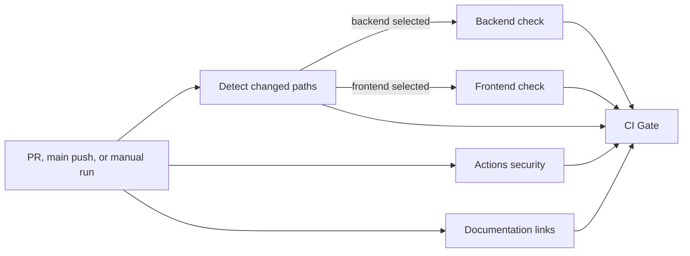

# Issue 44 Aggregate CI Gate Implementation Plan

## Goal

Add one stable `CI Gate` check that is reported on every pull request and blocks merging when any applicable CI check fails or is cancelled. Keep backend and frontend checks path-conditional while always enforcing Actions security and documentation checks.

## Context

[GitHub issue #44](https://github.com/CXwudi/nijigen-video-site/issues/44) is the source of truth. GitHub leaves a required check pending when an entire workflow is skipped by path filtering, while a conditionally skipped job inside a running workflow can be safely aggregated by an always-running downstream job.

The repository currently has four independent workflows. `Actions Security Check` and `Docs Link Check` run for every pull request, while `Backend Check` and `Frontend Check` use top-level path filters. The active `Default Rule` ruleset currently requires `Check Actions Security` from GitHub Actions and does not require the other checks.

Success means one top-level workflow owns automatic CI orchestration, reusable workflows retain the existing check implementations, and the `Default Rule` ruleset requires only `CI Gate`. Pull request behavior must be validated before changing the ruleset.

Assumptions:

- Preserve the current automatic events: `pull_request` and pushes to `main`.
- Preserve manual CI through the top-level workflow and run both component checks for a manual dispatch because there is no pull request change set to classify.
- Preserve the current backend and frontend path scopes, adding the top-level CI workflow itself to both scopes so orchestration changes exercise both components.
- Do not add merge queue support because the repository does not currently use a merge queue. Add `merge_group` in a separate change if that setting is enabled later.
- Keep the CI contract in this implementation plan; do not add workflow details to the documentation structure index.

## Approach

Create `.github/workflows/ci.yml` as the only final automatic entrypoint. It will detect changed paths once, call the four existing workflows through same-repository `workflow_call` jobs, and finish with a job named exactly `CI Gate` that uses `always()` and explicitly validates every dependency result.

Roll this out in two phases so the existing required check never disappears before its replacement is enforceable. The first phase temporarily keeps the standalone `Check Actions Security` trigger while the new aggregate workflow is validated; after the ruleset requires `CI Gate`, a cleanup phase removes that compatibility trigger.

## Design

### Path selection

| Check | Selection behavior | Paths |
| --- | --- | --- |
| Actions security | Always | Every pull request, `main` push, and manual run |
| Documentation links | Always | Every pull request, `main` push, and manual run |
| Backend | Conditional | `.github/workflows/ci.yml`, `.github/workflows/backend-check.yml`, `backend/**`, `infra/compose/**`, `infra/flyway/**`, `mise.toml`, and the existing explicit `backend/docker/mise.toml` entry |
| Frontend | Conditional | `.github/workflows/ci.yml`, `.github/workflows/frontend-check.yml`, `frontend/**`, `infra/compose/**`, `infra/flyway/**`, and `mise.toml` |
| `CI Gate` | Always | Every run of the top-level workflow |

Use `dorny/paths-filter` pinned to the verified `v4.0.2` commit `7b450fff21473bca461d4b92ce414b9d0420d706`. The detector checks out the repository because push events require Git-based change detection, and it receives only `contents: read` and `pull-requests: read` permissions.

### Gate contract

The `CI Gate` job must use `if: always()` with `needs` covering change detection and all four checks. Its shell step evaluates the dependency results rather than placing the success expression on the job itself; this guarantees that the stable gate job is created and can report failure.

| Dependency | Required gate input |
| --- | --- |
| Change detection | `success` |
| Actions security | `success` |
| Documentation links | `success` |
| Selected backend check | `success` |
| Non-selected backend check | `skipped` |
| Selected frontend check | `success` |
| Non-selected frontend check | `skipped` |

Any `failure`, `cancelled`, missing selection output, or mismatch between selection and result prevents the gate from succeeding. Requiring `skipped` for a non-selected component proves that it was intentionally omitted rather than silently accepted in an unexpected state.

### Permissions and secrets

Set top-level workflow permissions to none and grant permissions per job. The change detector receives `contents: read` and `pull-requests: read`; each of the four caller jobs explicitly receives `contents: read`, and the called jobs retain the same or narrower permissions; the gate receives no repository permissions. A called workflow cannot elevate permissions removed by its caller.

Declare `DOCKERHUB_USERNAME` and `DOCKERHUB_TOKEN` as optional `workflow_call` secrets in both component workflows. Each check logs in when both secrets are available, continues with anonymous pulls when neither is available, and fails when only one is configured. A partial pair cannot authenticate and indicates that an intended credential is missing; silently falling back would hide the configuration error and unexpectedly expose CI to anonymous pull rate limits. Pass only those two secrets explicitly from the caller. Do not use `secrets: inherit`, because the component checks do not need every repository secret.

### Concurrency

Keep the existing `${{ github.workflow }}-${{ github.ref }}` concurrency policy only on the top-level workflow. Remove concurrency blocks from called workflows: reusable workflows share caller context, so identical callee concurrency groups could cancel sibling checks or the caller.

## File and setting impact

- Create `.github/workflows/ci.yml` for event triggers, concurrency, path detection, reusable workflow calls, and `CI Gate`.
- Modify `.github/workflows/actions-security-check.yml` to support `workflow_call`; temporarily retain its existing automatic triggers during migration, then remove them after the ruleset switch.
- Modify `.github/workflows/docs-link-check.yml` to be reusable only.
- Modify `.github/workflows/backend-check.yml` to be reusable and declare its two Docker Hub secrets.
- Modify `.github/workflows/frontend-check.yml` to be reusable and declare its two Docker Hub secrets.
- Modify the external GitHub `Default Rule` ruleset only after `CI Gate` has been observed and validated.

## Steps

When executing the plan:

- Mark `[ ]` boxes as completed `[x]` while this plan has not been merged. After it is merged, treat it as immutable and record later completion evidence in issue #44 or a new follow-up design-log document.
- After the implementation and verification of each step, spawn a subagent to review the code and fix valuable feedback.
- Before moving to the next step, commit the changes.

### [x] Step 1: Introduce the aggregate workflow with a migration bridge

Create the complete aggregate workflow and reusable check boundaries without removing the currently required standalone check.

#### Step 1 implementation

1. Add `.github/workflows/ci.yml` with `pull_request`, push-to-`main`, and `workflow_dispatch` triggers. Move the current workflow-level concurrency policy to this file and set workflow permissions to none by default.
2. Add a change-detection job using the existing pinned checkout Action and `dorny/paths-filter@7b450fff21473bca461d4b92ce414b9d0420d706 # v4.0.2`. Publish `backend` and `frontend` string outputs. Force both outputs to `true` for `workflow_dispatch`.
3. Define the path lists from the Path selection table. Include `.github/workflows/ci.yml` in both filters so a change to selection or gate logic runs both component suites.
4. Convert documentation, backend, and frontend workflows to `workflow_call` only. Remove their automatic triggers and concurrency blocks, retaining their check steps except for the credential behavior in the following item.
5. Add `workflow_call` to the Actions security workflow but retain its existing automatic triggers as a temporary migration bridge. Remove its local concurrency block so concurrency is owned by the aggregate caller.
6. Define the two Docker Hub secrets as optional reusable-workflow secrets in backend and frontend. In each workflow, log in when both are available, continue anonymously when neither is available, and fail when only one is configured. Pass only those named secrets from the top-level caller.
7. Add caller jobs for all four reusable workflows and explicitly grant each caller job `contents: read`, because the top-level default denies all permissions. Actions security and documentation run unconditionally; backend and frontend use the detector outputs in job-level `if` expressions.
8. Add the `CI Gate` job with `if: always()`, every upstream job in `needs`, no repository permissions, and a short shell function that enforces the Gate contract table.

#### Step 1 verification

- Run `mise x actionlint@1.7.12 -- actionlint .github/workflows/*.yml` and expect every workflow and reusable call to pass.
- Run `uvx zizmor==1.26.1 --config .github/zizmor.yml .github/workflows` and expect no unsuppressed findings.
- Run `rg -n --pcre2 "uses:\\s*['\"]?[^'\"\\s]+@(?![0-9a-f]{40}(?:['\"\\s#]|$))" .github/workflows` and expect no external Action reference on a branch, tag, or short SHA.
- Run `mise //:docs-link-check` and expect all local documentation links to pass.
- Inspect the top-level permissions, called-workflow permissions, and passed secret names. Expect no write permissions and no broad secret inheritance.
- Open the implementation pull request. Expect the temporary standalone `Check Actions Security` to satisfy the old ruleset while the new aggregate run also reports `CI Gate`.

#### Step 1 notes

- Do not move all implementation steps into `ci.yml`; keeping the existing workflows reusable keeps files below the project size limit and preserves component ownership.
- The temporary duplicate Actions security run is intentional and must be removed in Step 4.

### [ ] Step 2: Validate the path and failure matrix in pull requests

Prove the aggregate behavior on GitHub before making it the required branch gate.

**Depends on:** Step 1

#### Step 2 implementation

Use short-lived pull requests targeting the implementation branch so they exercise the new workflow before it reaches `main`. Record run links in issue #44 or the implementation pull request.

1. Create a documentation-only verification change. Confirm both component jobs are skipped and `CI Gate` succeeds.
2. Create a backend-only verification change. Confirm backend runs, frontend skips, and the gate succeeds when backend succeeds.
3. Temporarily add an explicit failing backend step on the verification branch. Confirm backend and `CI Gate` fail, then revert the deliberate failure and confirm both recover.
4. Repeat the success and deliberate-failure checks for a frontend-only verification change.
5. Use the implementation pull request's `.github/workflows/ci.yml` change to confirm both component checks run together and both are required by the gate.
6. Cancel a complete aggregate run and confirm the required outcome for that commit is not successful; GitHub may cancel `CI Gate` before its shell step executes. Separately inspect the gate script and confirm its selected-component branches accept only `success`, so an exposed `cancelled` dependency result cannot pass. Push a new commit afterward to restore a green head commit.

#### Step 2 verification

- Inspect the aggregate run graph and job conclusions for every scenario.
- Confirm `CI Gate` is named exactly the same in documentation-only, backend-only, frontend-only, and combined runs.
- Confirm no scenario leaves a pending path-filtered workflow check because automatic path filters no longer exist on the component workflows.
- Confirm the implementation pull request remains mergeable under the old `Check Actions Security` requirement during this validation phase.

#### Step 2 notes

- Keep deliberate failures only on short-lived verification branches and revert them before merging.
- A skipped job can appear successful in the pull request UI; inspect `needs.<job>.result` behavior through the gate logs, where the expected value is `skipped`.

### [ ] Step 3: Switch the default-branch ruleset to `CI Gate`

Replace the old required check only after the new stable check has demonstrated all acceptance scenarios.

**Depends on:** Step 2

#### Step 3 implementation

1. Re-read the live `Default Rule` ruleset and capture its complete current configuration before editing. At planning time it targets `~DEFAULT_BRANCH`, preserves deletion and non-fast-forward protection, requires pull requests with zero approvals, has a pull-request-only user bypass, uses loose status checks, and requires `Check Actions Security` from GitHub Actions.
2. Merge the implementation pull request using the still-required standalone `Check Actions Security` compatibility result.
3. In the GitHub ruleset UI, replace only `Check Actions Security` with the observed `CI Gate` check from GitHub Actions. Preserve every other rule, condition, bypass actor, and the current loose required-check policy.
4. If the REST API is used instead of the UI, build a writable update payload from the current ruleset rather than submitting the GET response with read-only fields. Compare the returned ruleset against the pre-change state and confirm only the required check context changed.

#### Step 3 verification

- Query the live ruleset and expect exactly one required status check named `CI Gate` with the GitHub Actions integration.
- Open a small pull request and confirm GitHub reports `CI Gate` as required while component checks and `Check Actions Security` are not independently required.
- Confirm a red or cancelled `CI Gate` blocks a normal merge and a green `CI Gate` permits merging under the unchanged pull request rule.

#### Step 3 notes

- Do not remove the compatibility trigger before this step is complete; doing so could leave the old required check permanently pending.
- Keep Actions SHA pinning and read-only default workflow permissions unchanged.

### [ ] Step 4: Remove the compatibility trigger and finalize the design

Finish the one-entrypoint architecture after the ruleset safely depends on the aggregate gate.

**Depends on:** Step 3

#### Step 4 implementation

1. Change `.github/workflows/actions-security-check.yml` to `workflow_call` only, removing the temporary `pull_request`, push-to-`main`, and `workflow_dispatch` triggers.
2. Search all workflow files and confirm `.github/workflows/ci.yml` is the only workflow with automatic pull request and `main` push triggers.
3. Record final validation links and ruleset evidence in issue #44. Do not modify this plan after it has been merged; create a new design-log document if repository-local follow-up history is needed.

#### Step 4 verification

- Run actionlint, zizmor, the full-SHA search, and `mise //:docs-link-check`.
- Open the compatibility-trigger cleanup pull request and expect exactly one aggregate workflow run, successful security and documentation jobs, skipped component jobs, and a successful required `CI Gate`.
- Inspect the push-to-`main` run created by merging the cleanup pull request. Expect change detection to complete, both non-applicable component jobs to skip, and `CI Gate` to succeed.
- Manually dispatch the top-level workflow. Expect both component outputs to be forced to `true`, all four checks to run, and `CI Gate` to succeed only after all four checks succeed.
- Inspect the Actions run list after merging. Expect no duplicate standalone Actions security, documentation, backend, or frontend automatic runs.

### [ ] Step 5: Perform final acceptance verification

Confirm the repository matches every issue #44 acceptance criterion in its final state.

**Depends on:** Step 4

#### Step 5 implementation

Review the recorded pull request runs, final workflow files, documentation, and live ruleset. Fix only discrepancies that violate issue #44.

#### Step 5 verification

- Backend-only changes run backend; a backend failure or cancellation leaves `CI Gate` non-successful and blocks merging.
- Non-backend changes skip backend without preventing a successful `CI Gate`.
- Frontend-only changes run frontend; a frontend failure or cancellation leaves `CI Gate` non-successful and blocks merging.
- Non-frontend changes skip frontend without preventing a successful `CI Gate`.
- Shared or orchestration changes run both component checks and require both to succeed.
- Actions security and documentation checks run and are aggregated on every pull request.
- `CI Gate` has the same name on every pull request, including documentation-only changes.
- A push to `main` selects component checks from the pushed changes and still reports `CI Gate`.
- A manual dispatch intentionally runs both component checks and still reports `CI Gate`.
- The `Default Rule` ruleset requires only `CI Gate` from GitHub Actions.
- All workflow permissions remain least-privilege and every third-party Action remains pinned to a full commit SHA.
- The repository design record accurately describes path selection, manual behavior, and gate semantics.

## Risks and guardrails

- Required-check migration: removing `Check Actions Security` too early can block the migration pull request. Keep the compatibility trigger until the ruleset switch is verified.
- Concurrency collision: do not retain identical concurrency blocks in reusable workflows. The caller owns cancellation for the complete aggregate run.
- False-positive gate: do not treat `skipped` as universally acceptable. It is acceptable only when the matching path output is exactly `false`.
- False-negative gate: `CI Gate` must use `if: always()` as a job condition; otherwise an upstream failure can skip the gate entirely.
- Secret expansion: pass only the two Docker Hub secrets to component workflows. Keep login optional in both checks, but reject partial credential configuration.
- Ruleset overwrite: preserve all unrelated rules and bypass actors when replacing the required status context.
- Path drift: keep the path definitions centralized in the top-level workflow and record later selection changes in a follow-up design-log document.

## References

- [Issue #44: Add an aggregate CI gate for path-conditional checks](https://github.com/CXwudi/nijigen-video-site/issues/44)
- [GitHub: Troubleshooting required status checks](https://docs.github.com/en/pull-requests/collaborating-with-pull-requests/collaborating-on-repositories-with-code-quality-features/troubleshooting-required-status-checks)
- [GitHub: Reuse workflows](https://docs.github.com/en/actions/how-tos/reuse-automations/reuse-workflows)
- [GitHub: Contexts reference](https://docs.github.com/en/actions/reference/workflows-and-actions/contexts)
- [GitHub: Workflow syntax for `needs`](https://docs.github.com/en/actions/reference/workflows-and-actions/workflow-syntax-for-github-actions#jobsjob_idneeds)
- [GitHub: Control workflow concurrency](https://docs.github.com/en/actions/how-tos/write-workflows/choose-when-workflows-run/control-workflow-concurrency)
- [GitHub: Available rules for rulesets](https://docs.github.com/en/repositories/configuring-branches-and-merges-in-your-repository/managing-rulesets/available-rules-for-rulesets)
- [`dorny/paths-filter` documentation](https://github.com/dorny/paths-filter)
- [`dorny/paths-filter` v4.0.2](https://github.com/dorny/paths-filter/releases/tag/v4.0.2)
