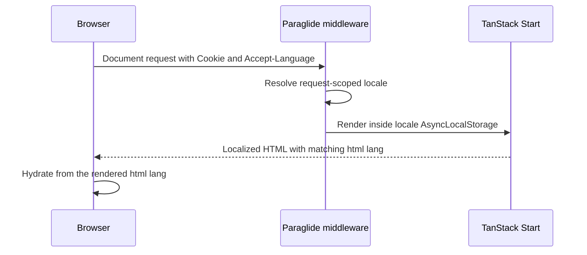

# Issue 31 TanStack Start i18n Design Spec

## Design Goal

Add internationalization for frontend-owned website UI strings while preserving TanStack Start server-side rendering.

The first HTML response must already use the resolved locale, and the browser must hydrate with that same locale without briefly rendering another language. English and Simplified Chinese are the initial supported locales, all locales use the same URLs, and a manual language preference persists in a cookie.

## Context

The frontend web application lives under `frontend/web/` and uses React, TanStack Start, and TanStack Router. Its root document currently hard-codes `<html lang="en">`, and its UI strings are embedded directly in route components.

Issue `#31` has established these product constraints:

- only frontend-owned website UI strings are localized;
- English (`en`) and Simplified Chinese (`zh-CN`) are initially supported;
- `zh-CN` is the fallback locale;
- the browser `Accept-Language` header should select a supported locale when no manual preference exists;
- all languages use the same URL;
- separate search-engine indexing for each locale is not required;
- changing language may perform a full document reload;
- losing unsaved in-memory form content during that reload is acceptable;
- a locale cookie is created only after a manual language selection;
- video titles, descriptions, transcripts, and other user or domain content remain single-language content.

TanStack Start creates a fresh router for each server render. The i18n integration must likewise keep locale state isolated per request so concurrent English and Chinese renders cannot affect each other.

## Design Decision

Use Paraglide JS as the frontend i18n library.

Paraglide provides compiled, type-safe message functions, a Vite integration, locale detection strategies, and server middleware backed by `AsyncLocalStorage`. TanStack maintains an official TanStack Start integration example, so this choice adds less custom SSR lifecycle code than a runtime React-specific library.

### Locale Configuration

Create an inlang project and commit the source message catalogs:

```text
frontend/web/
  messages/
    en.json
    zh-CN.json
  project.inlang/
    settings.json
  src/
    paraglide/
```

The entire `src/paraglide/` directory is compiler-generated and must not be committed or treated as translation source. Add `/web/src/paraglide/` to `frontend/.gitignore`; do not rely only on ignore files emitted inside the generated directory. The committed catalogs and inlang settings are the source of truth.

The inlang project uses pinned message-format modules and the committed catalogs as its source:

```json
{
  "$schema": "https://inlang.com/schema/project-settings",
  "baseLocale": "zh-CN",
  "locales": ["zh-CN", "en"],
  "modules": [
    "https://cdn.jsdelivr.net/npm/@inlang/plugin-message-format@4.4.0/dist/index.js",
    "https://cdn.jsdelivr.net/npm/@inlang/plugin-m-function-matcher@2.2.9/dist/index.js"
  ],
  "plugin.inlang.messageFormat": {
    "pathPattern": "./messages/{locale}.json"
  }
}
```

Add an exact `@inlang/paraglide-js` development dependency following the repository's pinned dependency convention. Version `2.22.0` is used; do not use a version range.

Configure the Paraglide Vite plugin with:

```ts
paraglideVitePlugin({
  project: './project.inlang',
  outdir: './src/paraglide',
  emitTsDeclarations: true,
  outputStructure: 'message-modules',
  strategy: ['cookie', 'preferredLanguage', 'baseLocale'],
})
```

Use Paraglide's default `PARAGLIDE_LOCALE` cookie name so Vite-plugin and CLI compilation share the same supported options without a separate programmatic compiler configuration.

The Vite plugin generates and watches messages during development and generates them for production builds. Add an `i18n:compile` package script for clean-checkout commands that do not load `vite.config.ts`:

```sh
paraglide-js compile --project ./project.inlang --outdir ./src/paraglide --strategy cookie preferredLanguage baseLocale --emit-ts-declarations
```

Wire this generation step before standalone type checking and tests, or provide an equivalent shared prerequisite. A clean checkout must not require a developer to run the development server before `typecheck` or `test` succeeds. Declaration emission is required because the current strict TypeScript configuration does not enable `allowJs`.

The locale resolution order is:

1. a valid `PARAGLIDE_LOCALE` cookie created by manual selection;
2. the best supported match from `Accept-Language`;
3. `zh-CN`.

Do not configure Paraglide's `url` strategy, localized URL patterns, or TanStack Router URL rewrites. Locale changes must not alter the pathname, query, or hash.

### SSR Request Lifecycle

Add a TanStack Start server entry that wraps the standard handler with `paraglideMiddleware`.



Every server-rendered message function and document metadata function executes inside the middleware's request-local locale context. `AsyncLocalStorage` remains enabled.

The root document must render the resolved locale:

```tsx
<html lang={getLocale()} dir={getTextDirection()}>
```

The `dir` attribute is included even though both initial locales are left-to-right, avoiding document-shell changes if a right-to-left locale is added later.

### Hydration Locale

The server-rendered `<html lang>` value is the source of truth for the initial browser document.

Add the optional TanStack Start client entry at `frontend/web/src/client.tsx`. Before calling `hydrateRoot`, it must override Paraglide's client locale reader to return a validated `document.documentElement.lang`, falling back to `baseLocale` only if the value is invalid:

```ts
overwriteGetLocale(() => toLocale(document.documentElement.lang) ?? baseLocale)

startTransition(() => {
  hydrateRoot(
    document,
    <StrictMode>
      <StartClient />
    </StrictMode>,
  )
})
```

The override must execute synchronously in the client entry before `hydrateRoot` creates `<StartClient />`. Application route and message modules must not make module-scope `getLocale()` calls before that setup. A dedicated, documented configuration function may encapsulate the override, but the client entry must invoke it before hydration.

This design intentionally does not let the client independently resolve `navigator.languages` during hydration. The server already resolved the browser preference from `Accept-Language`; reusing the serialized `<html lang>` value guarantees that the first client render agrees with SSR.

The override also avoids Paraglide's default initial client resolution behavior, which calls `setLocale(..., { reload: false })` and would write the detected locale into the configured cookie before a manual language selection.

### Manual Language Switching

The language switcher calls Paraglide's normal `setLocale(locale)` API.

For a different locale, Paraglide:

1. writes `PARAGLIDE_LOCALE` for the whole site;
2. performs a full document reload;
3. requests the unchanged URL with the new cookie;
4. lets SSR render the selected locale;
5. hydrates from the new `<html lang>` value.

The cookie is a client-readable preference cookie, not an authentication or authorization credential. It should remain host-only, use path `/`, and use Paraglide's default long-lived maximum age. It must not be `HttpOnly` because the client-side switcher writes it.

The switcher should identify languages by their own names, such as `简体中文` and `English`, rather than using country flags. The active locale must be programmatically identifiable for accessibility.

### Translation Usage

Components and route metadata import generated message functions from the Paraglide output. Locale state does not belong in React Context, TanStack Query, or Zustand.

The initial setup translates the existing frontend UI, including:

- navigation and page headings;
- buttons, badges, labels, and empty states;
- frontend validation and status messages;
- document titles and other user-visible metadata;
- accessible labels owned by the frontend.

Stable message identifiers must not be derived from the current source-language sentence. User-entered text and backend domain content must not be passed through UI message catalogs.

### Response Caching

The HTML representation of a same-URL page varies by `Cookie` and `Accept-Language`. Paraglide adds `Vary: Accept-Language` to locale redirects, but it does not add locale-aware caching headers to ordinary HTML responses.

The server entry must therefore apply these headers to every response whose `Content-Type` contains `text/html`, including HTML error responses:

```http
Vary: Cookie, Accept-Language
Cache-Control: private, no-store
```

When adding `Cookie` and `Accept-Language` to `Vary`, parse existing comma-separated tokens and perform a case-insensitive union and de-duplication. Do not replace existing tokens such as `Accept-Encoding`.

This initial policy prioritizes correct SSR language selection and prevents a shared cache from serving one user's locale to another user. It applies to HTML documents, not fingerprinted JavaScript, CSS, fonts, images, or other static assets.

If shared HTML caching becomes necessary, it requires a separate design that normalizes the selected locale into a bounded cache key.

### Validation

Implementation is complete when automated or reproducible checks demonstrate:

- no cookie plus `Accept-Language: en` returns English HTML with `<html lang="en">`;
- no cookie plus a supported Chinese preference returns Simplified Chinese HTML with `<html lang="zh-CN">`;
- no cookie plus no supported language returns Simplified Chinese HTML;
- a `PARAGLIDE_LOCALE=en` cookie overrides a Chinese `Accept-Language` preference;
- a `PARAGLIDE_LOCALE=zh-CN` cookie overrides an English `Accept-Language` preference;
- an invalid locale cookie falls through to header detection and then the base locale;
- the first automatically detected response has no `Set-Cookie` instruction for `PARAGLIDE_LOCALE`;
- after hydration settles and before any manual selection, `document.cookie` still has no `PARAGLIDE_LOCALE`;
- generated messages and declarations exist before clean-checkout type checking and tests;
- generating messages on a clean checkout leaves no generated files in `git status --short`;
- the first client render uses the SSR locale without hydration warnings or language flicker;
- manual switching creates `PARAGLIDE_LOCALE` and reloads the unchanged URL;
- every HTML response includes the required cache headers;
- concurrent requests with different locales do not leak translations across renders;
- lint, format, type checking, tests, and the production build pass.

## Alternatives Considered

### Locale Prefixes or Translated URLs

Paths such as `/en/videos` and `/zh-CN/videos` provide explicit cache keys and stronger multilingual SEO. They were rejected because issue `#31` requires a same-URL policy and does not require independent indexing for each locale.

### Client-Only Locale Detection

Detecting locale from `navigator.languages` or `localStorage` after hydration was rejected because the initial SSR output could use a different locale and visibly change after JavaScript starts.

### Automatically Persist the Detected Locale

Writing the `Accept-Language` result to a cookie on the first response or during hydration was rejected. The cookie represents an explicit manual preference; without one, future requests should continue to follow the browser header.

### Reactive In-Place Switching

Calling `setLocale(locale, { reload: false })` and maintaining additional React locale state could preserve in-memory form values. It was rejected because a full document reload is acceptable and keeps translations, `<html lang>`, direction, titles, metadata, and SSR state synchronized with less application code.

### react-i18next

`react-i18next` has a large ecosystem and flexible runtime loading. It was not selected because this application would need request-scoped i18next instances plus explicit initial-language and resource hydration. Paraglide already provides request isolation and a maintained TanStack Start integration.

### Hand-Written Message Dictionaries

Plain TypeScript or JSON dictionaries would minimize dependencies for two locales. They were rejected because they would recreate locale resolution, formatting, message typing, request isolation, and translation workflow conventions that Paraglide already provides.

## Scopes

### In Scope

- Paraglide and inlang configuration under `frontend/web/`;
- English and Simplified Chinese UI message catalogs;
- request-scoped SSR locale resolution;
- cookie, `Accept-Language`, and base-locale precedence;
- exact SSR-to-hydration locale synchronization;
- a same-URL manual language switcher with full document reload;
- localized frontend metadata and accessibility labels;
- HTML cache-safety headers;
- tests for locale precedence, SSR output, hydration, switching, and request isolation;
- frontend documentation updates needed to explain the i18n conventions.

### Out of Scope

- translated or locale-prefixed URLs;
- independent multilingual SEO;
- Traditional Chinese or additional locales;
- video titles, descriptions, transcripts, tags, or other domain content;
- multilingual fields in video upload or edit forms;
- translating arbitrary user-entered text;
- machine translation;
- a database-backed user locale preference;
- backend service internationalization;
- preserving unsaved in-memory state across a language switch;
- shared CDN caching of localized HTML.

## Risks and Open Questions

There are no blocking product questions.

- The browser bootstrap must install the client `getLocale()` override before any message function renders. An import-order regression could reintroduce a hydration mismatch or create an automatic locale cookie.
- Paraglide runtime behavior is version-sensitive. The dependency is pinned to `2.22.0`, and tests protect the no-cookie-before-manual-switch requirement.
- `Accept-Language` negotiation is delegated to the pinned Paraglide implementation. Behaviour for edge cases (e.g. generic `zh`, `q=0`, malformed ranges) may change across Paraglide upgrades; only the supported-locale and cookie-precedence matrix is verified.
- If a browser blocks preference cookies, manual selection will not persist across document reloads. Header detection and the base locale still provide a valid SSR result.
- `Accept-Language` can be absent or contain no supported locale. This is expected and resolves to `zh-CN`.
- `Cache-Control: private, no-store` prevents shared HTML caching and may increase SSR load. Correctness takes precedence until a bounded locale-aware cache design is justified.
- The deployed Nitro and Node.js runtime must preserve `AsyncLocalStorage` across streaming SSR. Production-build verification must cover the actual runtime artifact.

## References

| Resource | Description | Notes |
| --- | --- | --- |
| [GitHub issue #31](https://github.com/CXwudi/nijigen-video-site/issues/31) | Product request and locked UI-only, locale, same-URL, SSR, and switching constraints. | Must Read |
| [Frontend root document](../../frontend/web/src/routes/__root.tsx) | Current root shell with a hard-coded English `lang` attribute and static metadata. | Must Read |
| [Frontend router](../../frontend/web/src/router.tsx) | Current per-render TanStack Router and Query setup that the i18n lifecycle must preserve. | Important |
| [Frontend package manifest](../../frontend/web/package.json) | Current TanStack Start, React, Vite, and TypeScript dependency baseline. | Important |
| [TanStack Router internationalization guide](https://tanstack.com/router/latest/docs/guide/internationalization-i18n) | Official routing and TanStack Start integration patterns for i18n. | Important |
| [TanStack Start Paraglide example](https://github.com/TanStack/router/tree/main/examples/react/start-i18n-paraglide) | Official example for the Vite plugin, server middleware, root document, and language switcher. | Must Read |
| [Paraglide TanStack Start guide](https://paraglidejs.com/tanstack-start) | Framework-specific setup and SSR server entry guidance. | Must Read |
| [TanStack Start client entry guide](https://tanstack.com/start/latest/docs/framework/react/guide/client-entry-point) | Supported custom `src/client.tsx` entry and default React hydration sequence. | Must Read |
| [Paraglide compiling guide](https://paraglidejs.com/compiling-messages) | Vite, CLI, clean-checkout generation, and TypeScript declaration options. | Important |
| [Paraglide strategy guide](https://paraglidejs.com/strategy) | Strategy precedence and cookie, preferred-language, base-locale, and custom resolution behavior. | Must Read |
| [Paraglide SSR guide](https://paraglidejs.com/server-side-rendering) | Request isolation, hydration, streaming, and fallback behavior. | Important |
| [Paraglide locale API](https://paraglidejs.com/basics#getting-and-setting-the-locale) | Full-document locale switching and the limitations of reactive switching without reload. | Important |
| [Paraglide client locale source](https://github.com/opral/paraglide-js/blob/main/src/compiler/runtime/get-locale.js) | Shows initial client resolution, strategy evaluation, and automatic `setLocale` behavior avoided by the client override. | Must Read |
| [Paraglide server middleware source](https://github.com/opral/paraglide-js/blob/main/src/compiler/server/middleware.js) | Shows request isolation and the limited automatic `Vary` behavior that motivates explicit HTML cache headers. | Must Read |
